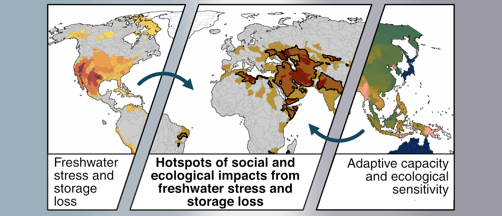

#### In `Data-preprocessing` folder:
`1_resolution-harmonize.R` → Harmonizes all input data to 0.5 degrees.   
`2_freshwater-consumption-and-withdrawal-rates-2010.R` → Prepares annual withdrawal and consumption rates from Huang et al. (2018) for the year 2010.  
`3_streamflow-alternatives.R`  → Prepares annual streamflow rasters at 0.5 degrees for GSCD and GRUN alternatives.  
`4_hydrobasins-clean.R` → Prepares HydroBASINS discretization schemes for use at Levels 3, 4, and 5.  

#### Core scripts:
`0_udfs.R` → All user defined functions used in project.  
`0_load-libraries-udfs.R` → Loads all necessary libraries and user defined functions, located at the top of every subsequent script.  
`1_freshwater-stress-tws-trends.R` → Calculates and compares freshwater stress and trends in terrestrial water storage.  
`2_combined-freshwater-stress-indicator.R` → Derives an indicator to represent the co-occurrence of freshwater stress and storage loss.  
`3_combined-stress-indicator-adaptive-capacity.R` → Compares social adaptive capacity to the derived combined freshwater stress indicator.  
`4_vulnerability-hotspots.R` → Performs global social-ecological vulnerability analysis to the combined freshwater hazards of freshwater stress and storage loss.  
`5_iwrm-implementaiton-comparison.R` → Compares vulnerabiltiy results from `4_...` with implementation levels of IWRM.  
`6_uncertainty-spatially-uniform.R` → Executes uncertainty analysis, considering spatially uniform uncertainty in input data.  
`6_uncertainty-spatially-variable.R` → Executes uncertainty analysis, considering spatially variable uncertainty in input data.  
`7_subjectivity-analysis.R` → Considers impact of subjective methodological choises on final vulnerability hotspot results.  
